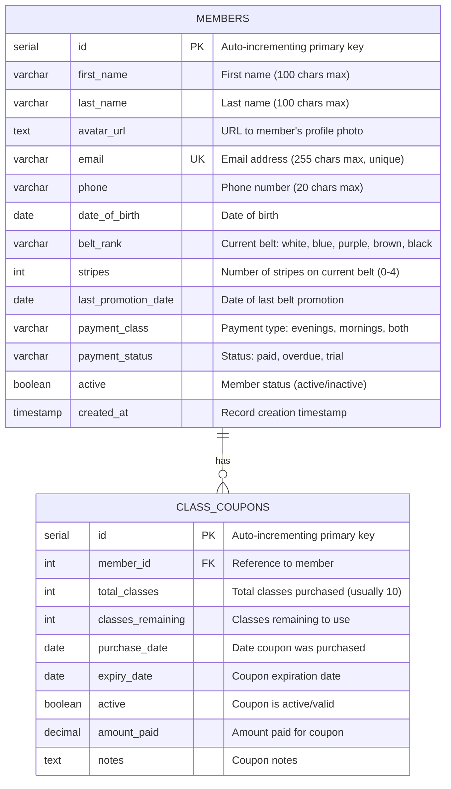

# Entity Relationship Diagram (ERD)
## Monkey Grip Admin App - BJJ Club Management System (Simplified)

### Database Overview
- **Database Type**: PostgreSQL 17
- **Schema**: bjj_club_db
- **Application**: Simple BJJ club member management system
- **Created**: September 2025

---

## Entities and Relationships

### Entity: `members`
**Purpose**: Core member information with essential BJJ details

#### Table Structure
```sql
CREATE TABLE IF NOT EXISTS members (
    id SERIAL PRIMARY KEY,
    first_name VARCHAR(100) NOT NULL,
    last_name VARCHAR(100) NOT NULL,
    avatar_url TEXT,
    email VARCHAR(255) UNIQUE,
    phone VARCHAR(20),
    date_of_birth DATE,
    belt_rank VARCHAR(20) DEFAULT 'white',
    stripes INTEGER DEFAULT 0 CHECK (stripes >= 0 AND stripes <= 4),
    last_promotion_date DATE,
    payment_class VARCHAR(20) DEFAULT 'evenings',
    payment_status VARCHAR(20) DEFAULT 'trial',
    active BOOLEAN DEFAULT TRUE,
    created_at TIMESTAMP DEFAULT CURRENT_TIMESTAMP
);
```

#### Field Descriptions
| Field Name | Data Type | Constraints | Description |
|------------|-----------|-------------|-------------|
| `id` | SERIAL | PRIMARY KEY | Auto-incrementing unique identifier |
| `first_name` | VARCHAR(100) | NOT NULL | Member's first name |
| `last_name` | VARCHAR(100) | NOT NULL | Member's last name |
| `avatar_url` | TEXT | NULLABLE | URL to member's profile photo |
| `email` | VARCHAR(255) | UNIQUE | Member's email address |
| `phone` | VARCHAR(20) | NULLABLE | Phone number |
| `date_of_birth` | DATE | NULLABLE | Date of birth |
| `belt_rank` | VARCHAR(20) | DEFAULT 'white' | Current belt: white, blue, purple, brown, black |
| `stripes` | INTEGER | CHECK (0-4) | Number of stripes on current belt |
| `last_promotion_date` | DATE | NULLABLE | Date of most recent promotion |
| `payment_class` | VARCHAR(20) | DEFAULT 'evenings' | Payment type: evenings, mornings, both |
| `payment_status` | VARCHAR(20) | DEFAULT 'trial' | Status: paid, overdue, trial |
| `active` | BOOLEAN | DEFAULT TRUE | Member is active |
| `created_at` | TIMESTAMP | DEFAULT NOW | Record creation time |

### Entity: `class_coupons`
**Purpose**: Track 10-class coupons purchased by members

#### Table Structure
```sql
CREATE TABLE IF NOT EXISTS class_coupons (
    id SERIAL PRIMARY KEY,
    member_id INTEGER REFERENCES members(id) ON DELETE CASCADE,
    total_classes INTEGER DEFAULT 10,
    classes_remaining INTEGER DEFAULT 10,
    purchase_date DATE DEFAULT CURRENT_DATE,
    expiry_date DATE,
    active BOOLEAN DEFAULT TRUE,
    amount_paid DECIMAL(10,2),
    notes TEXT
);
```

#### Field Descriptions
| Field Name | Data Type | Constraints | Description |
|------------|-----------|-------------|-------------|
| `id` | SERIAL | PRIMARY KEY | Auto-incrementing unique identifier |
| `member_id` | INTEGER | FOREIGN KEY | Reference to member who bought coupon |
| `total_classes` | INTEGER | DEFAULT 10 | Total classes purchased (usually 10) |
| `classes_remaining` | INTEGER | DEFAULT 10 | Classes left to use |
| `purchase_date` | DATE | DEFAULT TODAY | Date coupon was purchased |
| `expiry_date` | DATE | NULLABLE | When coupon expires |
| `active` | BOOLEAN | DEFAULT TRUE | Coupon is valid/active |
| `amount_paid` | DECIMAL(10,2) | NULLABLE | Amount paid for coupon |
| `notes` | TEXT | NULLABLE | Additional notes |

---

## Visual ERD (Mermaid Syntax)



---

## Business Rules (Simplified)

### Belt System
1. **Belt Ranks**: white, blue, purple, brown, black
2. **Stripes**: 0-4 stripes per belt
3. **Promotion Tracking**: Only latest promotion date stored

### Payment Classes
1. **Evenings**: Standard evening classes
2. **Mornings**: Morning session access
3. **Both**: Full access to all sessions
4. **Coupons**: 10-class packages

### Payment Status
1. **Paid**: Current with payments
2. **Overdue**: Behind on payments
3. **Trial**: New member trial period

### Class Coupons
1. **Standard Package**: 10 classes per coupon
2. **Expiration**: Optional expiry date
3. **Usage Tracking**: Classes remaining decrements with use
4. **Multiple Coupons**: Members can have multiple active coupons

---

## Sample Data

### Example Members
```sql
INSERT INTO members (first_name, last_name, avatar_url, email, phone, date_of_birth, belt_rank, stripes, payment_class, payment_status) VALUES 
('João', 'Silva', 'https://images.unsplash.com/photo-1507003211169-0a1dd7228f2d?w=150&h=150&fit=crop&crop=face', 'joao.silva@email.com', '+1-555-0123', '1990-05-15', 'blue', 2, 'evenings', 'paid'),
('Maria', 'Santos', 'https://images.unsplash.com/photo-1494790108755-2616b612b786?w=150&h=150&fit=crop&crop=face', 'maria.santos@email.com', '+1-555-0124', '1995-03-20', 'white', 4, 'both', 'paid'),
('Carlos', 'Oliveira', 'https://images.unsplash.com/photo-1472099645785-5658abf4ff4e?w=150&h=150&fit=crop&crop=face', 'carlos.oliveira@email.com', '+1-555-0125', '1988-12-10', 'purple', 1, 'mornings', 'overdue'),
('Ana', 'Costa', 'https://images.unsplash.com/photo-1438761681033-6461ffad8d80?w=150&h=150&fit=crop&crop=face', 'ana.costa@email.com', '+1-555-0126', '1992-07-08', 'white', 0, 'evenings', 'trial');
```

### Example Class Coupons
```sql
INSERT INTO class_coupons (member_id, total_classes, classes_remaining, amount_paid, expiry_date) VALUES 
(4, 10, 8, 150.00, '2025-01-31'),  -- Ana's trial coupon
(1, 10, 3, 150.00, '2024-12-31'),  -- João's almost finished coupon
(2, 10, 10, 150.00, '2025-02-28'); -- Maria's new coupon
```

---

## API Endpoints (Simplified)

### Member Management
| Operation | HTTP Method | Endpoint | Description |
|-----------|-------------|----------|-------------|
| List Members | GET | `/api/members` | Get all members with optional filters |
| Get Member | GET | `/api/members/:id` | Get single member details |
| Create Member | POST | `/api/members` | Add new member |
| Update Member | PUT | `/api/members/:id` | Update member information |
| Delete Member | DELETE | `/api/members/:id` | Deactivate member |
| Search Members | GET | `/api/members?search=term` | Search by name, email, or belt |
| Upload Avatar | POST | `/api/members/:id/avatar` | Upload member profile photo |

### Class Coupon Management
| Operation | HTTP Method | Endpoint | Description |
|-----------|-------------|----------|-------------|
| Get Member Coupons | GET | `/api/members/:id/coupons` | Get member's active coupons |
| Create Coupon | POST | `/api/coupons` | Issue new 10-class coupon |
| Use Coupon | PATCH | `/api/coupons/:id/use` | Decrement classes remaining |
| Coupon Status | GET | `/api/coupons/:id` | Get coupon details and usage |

---

## Database Schema Files

### Database Initialization Script
```sql
-- File: contacts-backend/init-db.sql
CREATE TABLE IF NOT EXISTS members (
    id SERIAL PRIMARY KEY,
    first_name VARCHAR(100) NOT NULL,
    last_name VARCHAR(100) NOT NULL,
    avatar_url TEXT,
    email VARCHAR(255) UNIQUE,
    phone VARCHAR(20),
    date_of_birth DATE,
    belt_rank VARCHAR(20) DEFAULT 'white',
    stripes INTEGER DEFAULT 0 CHECK (stripes >= 0 AND stripes <= 4),
    last_promotion_date DATE,
    payment_class VARCHAR(20) DEFAULT 'evenings',
    payment_status VARCHAR(20) DEFAULT 'trial',
    active BOOLEAN DEFAULT TRUE,
    created_at TIMESTAMP DEFAULT CURRENT_TIMESTAMP
);

CREATE TABLE IF NOT EXISTS class_coupons (
    id SERIAL PRIMARY KEY,
    member_id INTEGER REFERENCES members(id) ON DELETE CASCADE,
    total_classes INTEGER DEFAULT 10,
    classes_remaining INTEGER DEFAULT 10,
    purchase_date DATE DEFAULT CURRENT_DATE,
    expiry_date DATE,
    active BOOLEAN DEFAULT TRUE,
    amount_paid DECIMAL(10,2),
    notes TEXT
);

-- Indexes for performance
CREATE INDEX idx_members_belt_rank ON members(belt_rank, stripes);
CREATE INDEX idx_members_payment_status ON members(payment_status);
CREATE INDEX idx_coupons_member_active ON class_coupons(member_id, active);
```

### Seed Data
```sql
-- File: contacts-backend/seed-data.sql
INSERT INTO members (first_name, last_name, avatar_url, email, phone, date_of_birth, belt_rank, stripes, payment_class, payment_status, last_promotion_date) VALUES 
('João', 'Silva', 'https://images.unsplash.com/photo-1507003211169-0a1dd7228f2d?w=150&h=150&fit=crop&crop=face', 'joao.silva@email.com', '+1-555-0123', '1990-05-15', 'blue', 2, 'evenings', 'paid', '2024-06-01'),
('Maria', 'Santos', 'https://images.unsplash.com/photo-1494790108755-2616b612b786?w=150&h=150&fit=crop&crop=face', 'maria.santos@email.com', '+1-555-0124', '1995-03-20', 'white', 4, 'both', 'paid', '2024-08-15'),
('Carlos', 'Oliveira', 'https://images.unsplash.com/photo-1472099645785-5658abf4ff4e?w=150&h=150&fit=crop&crop=face', 'carlos.oliveira@email.com', '+1-555-0125', '1988-12-10', 'purple', 1, 'mornings', 'overdue', '2024-01-20'),
('Ana', 'Costa', 'https://images.unsplash.com/photo-1438761681033-6461ffad8d80?w=150&h=150&fit=crop&crop=face', 'ana.costa@email.com', '+1-555-0126', '1992-07-08', 'white', 0, 'evenings', 'trial', NULL);

INSERT INTO class_coupons (member_id, total_classes, classes_remaining, amount_paid, expiry_date) VALUES 
(4, 10, 8, 150.00, '2025-01-31'),
(1, 10, 3, 150.00, '2024-12-31'),
(2, 10, 10, 150.00, '2025-02-28');
```

---

## Key Features of Simplified Design

### Advantages
1. **Easy to Understand**: Only 2 tables with clear relationships
2. **Quick Setup**: Minimal complexity for fast development
3. **BJJ-Specific**: Includes belt ranks and stripe tracking
4. **Flexible Payments**: Supports both subscriptions and coupons
5. **Extensible**: Easy to add features later

### Core Functionality
1. **Member Profiles**: Essential info including belt progression
2. **Payment Tracking**: Different payment classes and status
3. **Coupon System**: 10-class packages with usage tracking
4. **Contact Info**: Phone and email for communication
5. **Age Verification**: DOB for age-appropriate classes

### Business Operations Supported
1. **Member Registration**: Add new students quickly
2. **Belt Promotions**: Track progression and promotion dates  
3. **Payment Management**: Monitor payment status
4. **Class Package Sales**: Sell and track 10-class coupons
5. **Member Communication**: Contact info readily available

---

*This simplified ERD focuses on core BJJ club operations while maintaining the flexibility to expand with additional features as needed. Perfect for getting started quickly while keeping essential functionality intact.*